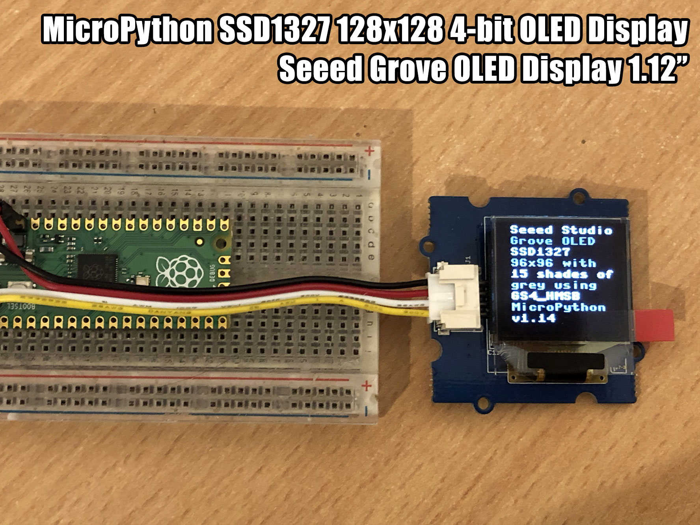

# SSD1327

A MicroPython library for SSD1327 128x128 4-bit greyscale OLED displays, over I2C.

For example, the [Grove - OLED Display 1.12"](http://wiki.seeed.cc/Grove-OLED_Display_1.12inch/) which features a 96x96 display.



## Example

Copy the file to your device, using ampy, webrepl or compiling and deploying. eg.

```
$ ampy put ssd1327.py
```

**Hello World**

```
import ssd1327
from machine import I2C, Pin

i2c = I2C(sda=Pin(4), scl=Pin(5))
# display = ssd1327.SSD1327_I2C(96, 96, i2c, 60)
display = ssd1327.SEEED_OLED_96X96(i2c)

for y in range(0,12):
    display.text('Hello World', 0, y * 8, 15 - y)
display.show()
```

See [ssd1327_examples.py](ssd1327_examples.py) for more.

## Parts

* [WeMos D1 Mini](https://www.aliexpress.com/store/product/D1-mini-Mini-NodeMcu-4M-bytes-Lua-WIFI-Internet-of-Things-development-board-based-ESP8266/1331105_32529101036.html) $4.00 USD
* [Grove OLED Display 1.12"](https://www.seeedstudio.com/Grove-OLED-Display-1.12%22-p-824.html) $14.90 USD
* [Grove Male Jumper Cable](https://www.seeedstudio.com/Grove-4-pin-Male-Jumper-to-Grove-4-pin-Conversion-Cable-%285-PCs-per-Pack%29-p-1565.html) $2.90 USD

## Connections

WeMos D1 Mini | Grove OLED
------------- | ----------
D1 (GPIO5)    | SCL
D2 (GPIO4)    | SDA
3V3 (or 5V)   | VCC
G             | GND

## Links

* [WeMos D1 Mini](https://wiki.wemos.cc/products:d1:d1_mini)
* [micropython.org](http://micropython.org)
* [Adafruit Ampy](https://learn.adafruit.com/micropython-basics-load-files-and-run-code/install-ampy)